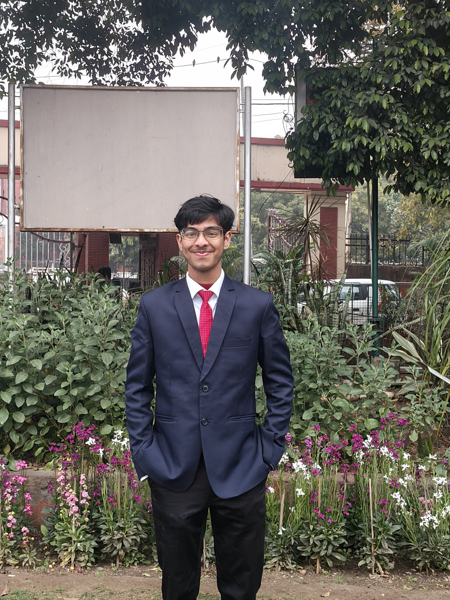
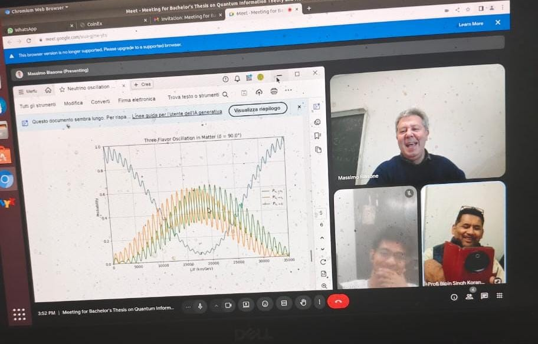
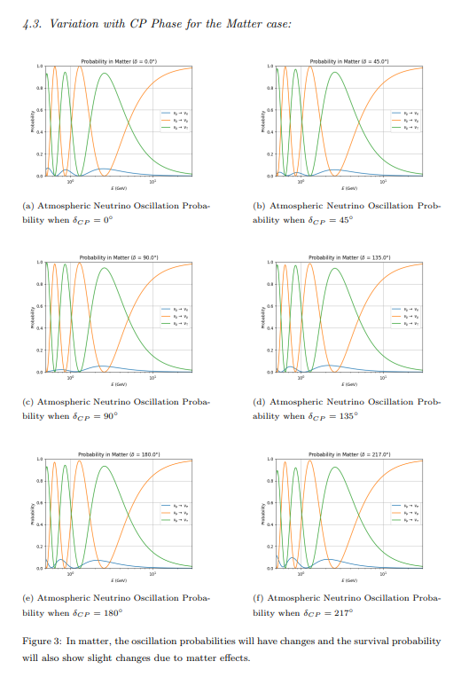
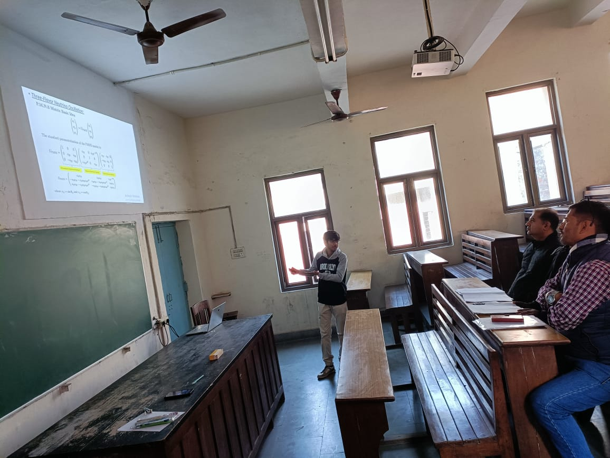
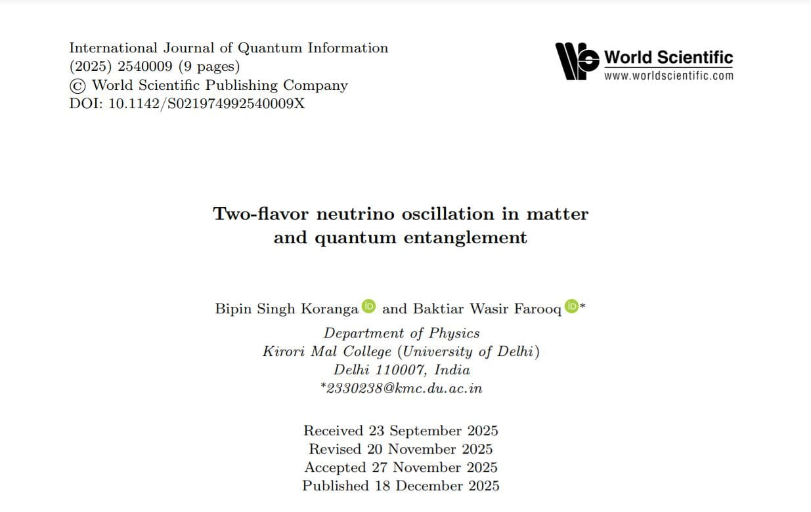

<!-- ================= HEADER ================= -->

  

<h1 align="center">Baktiar Wasir Farooq</h1>

B.Sc. (Hons.) Physics  
Kirori Mal College, University of Delhi  
Quantum Information • Neutrino Oscillations • Theoretical Particle Physics

---

## About

I am an undergraduate Physics student at Kirori Mal College, University of Delhi (CGPA: 8.23/10).  

My research lies at the intersection of **neutrino oscillations, quantum information theory, CP violation, and mathematical physics**. I am particularly interested in how quantum correlations — especially entanglement entropy — can serve as probes of fundamental particle interactions and possible Planck-scale effects.

I aim to pursue a Ph.D. in theoretical high energy physics, focusing on the quantum foundations of particle phenomenology.

---

# Research Experience

---

<table>
<tr>
<td width="170">

</td>
<td>

### Quantum Information Theoretic Approaches to Neutrino Oscillations  
**Bachelor Thesis Project**

Collaboration with University of Salerno (Italy)  

Supervisors:  
Prof. Massimo Blasone  
Prof. Bipin Singh Koranga  

This project investigates neutrino flavor oscillations using quantum information measures. The work includes density matrix formalism, entanglement entropy evolution, and CP-phase dependence in three-flavor systems.

</td>
</tr>
</table>

---

<table>
<tr>
<td width="170">

</td>
<td>

### NeutrinoOsc3Flavor — CP Phase Dependence in Three-Flavor Oscillations

Computational and analytical modeling of three-flavor neutrino oscillations in matter.

Main contributions:
- Numerical simulation of oscillation probabilities
- Analytical derivation of effective matter eigenstates
- CP phase dependence studies
- Python-based Hamiltonian evolution framework

🔗 GitHub:  
https://github.com/baktiar238/NeutrinoOsc3Flavor

</td>
</tr>
</table>

---

<table>
<tr>
<td width="170">

</td>
<td>

### SEC Research Internship — CP Violation in Long-Baseline Experiments  
Jawaharlal Nehru University

Worked on CP violation in three-flavour neutrino oscillations using Hamiltonian-based numerical evolution in constant-density matter.

Project components:
- Exact computation of appearance probabilities
- Generation of bi-probability ellipses
- Numerical evaluation of CP asymmetry  
  A_CP = (Pμe − P̄μe) / (Pμe + P̄μe)
- Sensitivity analysis across multiple baselines

</td>
</tr>
</table>

---

<table>
<tr>
<td width="170">

</td>
<td>

### Two-Flavor Neutrino Oscillation in Matter and Quantum Entanglement  

Published work exploring entanglement entropy in two-flavor neutrino oscillations using density matrix formalism and quantum correlation analysis.

</td>
</tr>
</table>

---

# Publications

- Modified Entanglement Patterns in Two-Flavor Neutrinos from Quantum-Gravity Interactions  

- [Two-Flavor Neutrino Oscillation in Matter and Quantum Entanglement](https://doi.org/10.1142/S021974992540009X)

---

# Computational & Academic Projects

- Python simulations of quantum mechanical systems  
- Solar spectrum astronomical data analysis  
- Circular particle accelerator (LHC) working model  
- Mathematical modeling of oscillatory systems  

---

# Technical Skills

- Python (NumPy, Matplotlib, Pandas)  
- Quantum Mechanics & Mathematical Physics  
- Density Matrix Formalism  
- Data Analysis & Computational Modeling  
- LaTeX  

---

# Academic Coursework

Mechanics • Waves & Oscillations • Electricity & Magnetism •  
Quantum Mechanics • Statistical Mechanics •  
Mathematical Physics I–III • Tensor Analysis •  
Electromagnetic Theory • Solid State Physics •  
Particle & Nuclear Physics • Numerical Analysis •  
Astronomy & Astrophysics • Research Methodology  

---

# Honors & Achievements

- KMC Research Recognition Certificate Students (2025)  
- ATSE Scholarship – All India Rank 37  
- Multiple Physics Poster Presentation Awards  
- SOF International Mathematics Olympiad – Zonal Rank 21  
- Physics Model Exhibition Awards  

---

# Contact

Email: 2330238@kmc.du.ac.in  

LinkedIn:  
https://www.linkedin.com/in/baktiar-wasir-farooq-63b666258/

ORCID:  
https://orcid.org/0009-0006-6491-6167  

Inspire-HEP:  
https://inspirehep.net/authors/3115378  

GitHub:  
https://github.com/baktiar238
